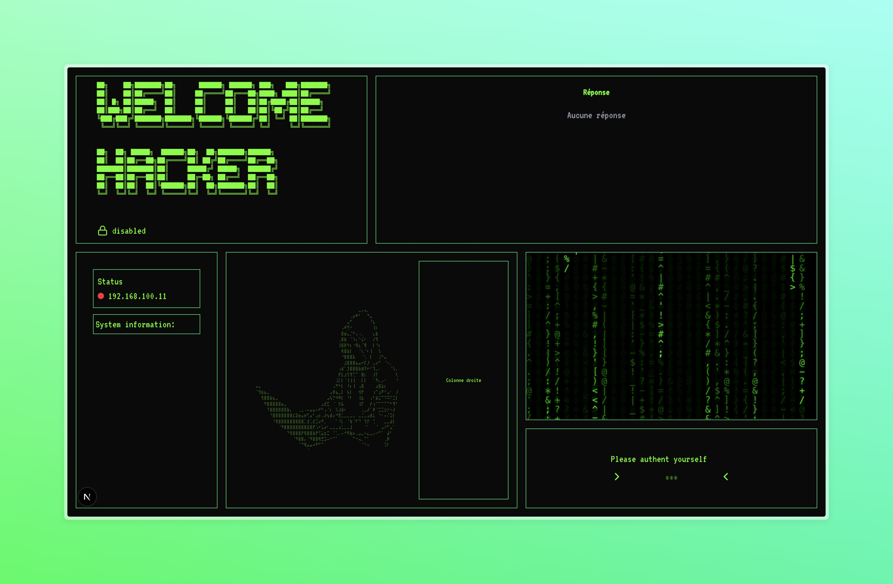

# 🧱 Architecture du Projet EpiRootkit

Le projet **EpiRootkit** est composé de plusieurs briques logicielles qui interagissent pour simuler un scénario d’attaque réaliste dans un environnement pédagogique et contrôlé.  
Cette page présente l’architecture générale du projet ainsi que le rôle de chaque composant.

---

## 📦 Vue d’ensemble

                   +-----------------+
                   |  Machine Attaque|
                   |-----------------|
                   | Frontend (React)|
                   |       |         |
                   |CommunicationHttp|
                   |       |         |
                   | Backend (Python)|
                   +--------^--------+
                            |
                   Communication via TCP
                            |
                   +--------v--------+
                   | Machine Victime |
                   |-----------------|
                   |    Rootkit      |
                   +-----------------+

---

## 🖥️ Composants principaux

### 1. `machines/` – Environnement virtuel

Ce dossier contient tous les scripts et fichiers nécessaires à la création et au lancement des **machines virtuelles (VM)**.

- `start_attack.sh` et `start_victim.sh` : démarrent respectivement les VM attaquante et victime.
- `cloudinit-A/` et `cloudinit-V/` : contiennent les fichiers de configuration cloud-init pour initialiser les VM.
- `fill_attack.sh` / `fill_victim.sh` : injectent les fichiers nécessaires (code, frontend, backend, rootkit, etc.) dans chaque VM.
- `init_vms.sh` : initialise les VM avec leurs configurations.

---

### 2. `frontend/` – Interface utilisateur

Développée en **React**, l’interface permet d’interagir avec le backend de l’attaquant de façon conviviale.

Fonctionnalités :

- Visualisation du statut du rootkit
- Visualisation des informations système de la machine attaquée
- Émulation d'un stdout, stderr et visualisation du return code
- Interface d'authentification
- Visualisation des fichiers téléchargés

---

### 3. `backend/` – Serveur d’attaque

Un script Python (`server.py`) agit en tant que **serveur TCP** recevant les commandes de l’interface frontend et interagissant avec la VM victime.

Composants :

- `server.py` : gère les connexions et les échanges de données.
- `setup.sh` : initialise l’environnement backend.

---

### 4. `rootkit/` – Module noyau

Il s’agit du **coeur du projet** : un module kernel (`rootkit.ko`) capable de masquer des processus, fichiers, ports, etc.

Fichiers principaux :

- `rootkit.c` : implémentation du rootkit.
- `AES.c/h` : implémentation de l’algorithme de chiffrement symétrique AES utilisé par le rootkit.
- `Makefile` : compilation du module.

Le rootkit est inséré manuellement via `insmod` dans la machine victime.

---

### 5. Scripts réseau

- `setup_bridge.sh` / `setup_bridge_v2.sh` : configurent un bridge réseau sur la machine hôte pour permettre aux VM de communiquer entre elles via une interface commune.

---

## 🔄 Cycle d’exécution typique

1. **Initialisation** :  
   L’utilisateur crée un bridge, puis démarre les deux VM (`victime` et `attaquant`).

2. **Déploiement** :  
   Les scripts `fill_*.sh` injectent frontend, backend, et rootkit dans les VM respectives.

3. **Lancement** :

   - Le backend Python est lancé sur l’attaquant.
   - Le frontend permet de piloter les actions à distance.
   - Le rootkit est compilé et inséré sur la victime.

4. **Interaction** :  
   Le frontend envoie des commandes via le backend → socket TCP → vers la victime → exécution des actions rootkit.

---

<!-- ## 🔐 Sécurité & Cloaking

- Chiffrement des communications avec **AES**
- Masquage de :
  - fichiers/dossiers
  - processus
  - ports d’écoute
  - module noyau lui-même (`/proc/modules`)

--- -->
